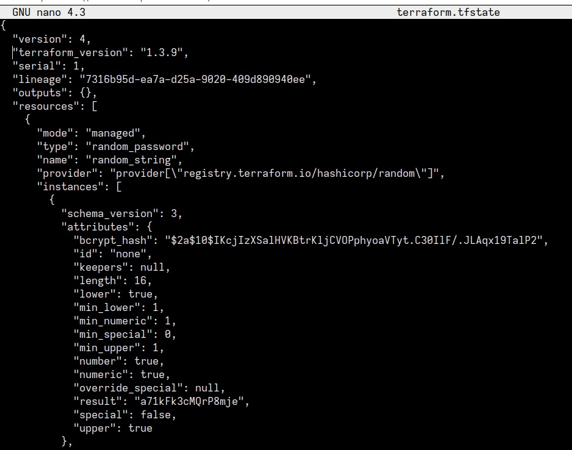
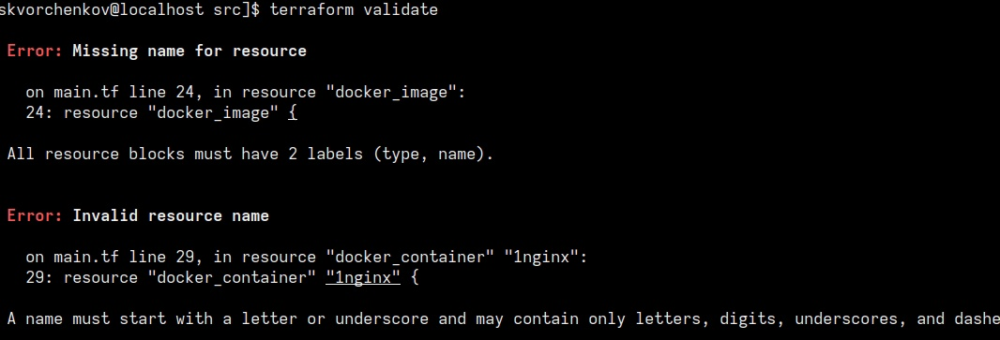
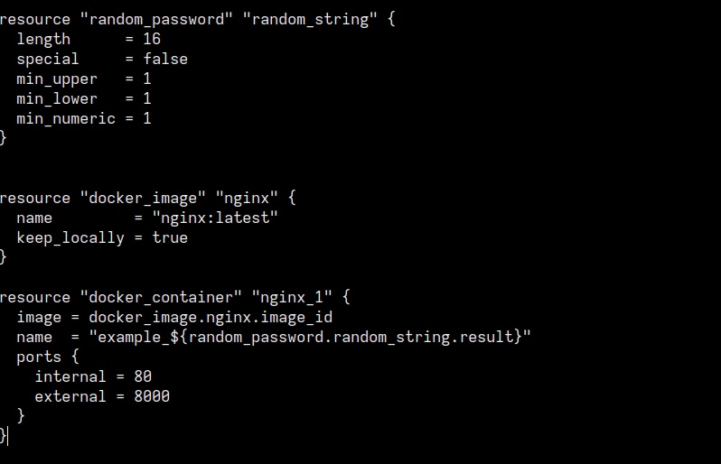
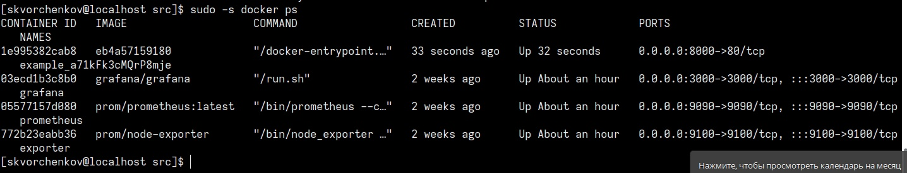
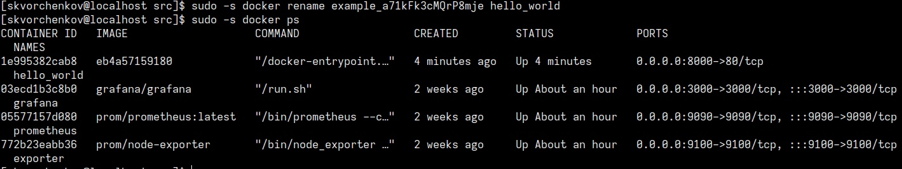
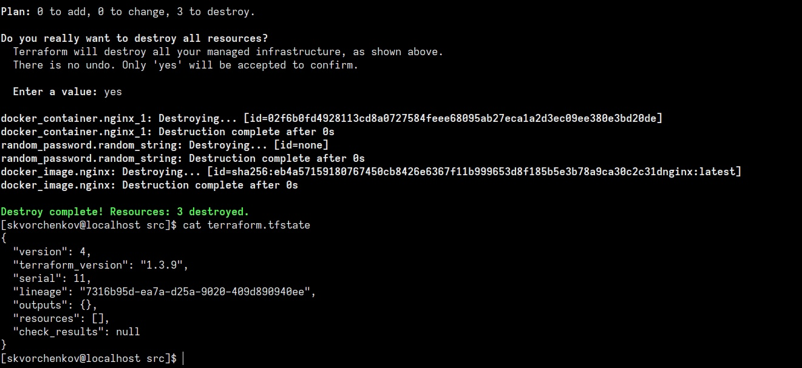

# Домашнее задание к занятию "Введение в Terraform"

## Задача 1
- Перейдите в каталог src. Скачайте все необходимые зависимости, использованные в проекте.
- Изучите файл .gitignore. В каком terraform файле согласно этому .gitignore допустимо сохранить личную, секретную информацию?
- Выполните код проекта. Найдите в State-файле секретное содержимое созданного ресурса random_password, пришлите в качестве ответа -конкретный ключ и его значение.
- Раскомментируйте блок кода, примерно расположенный на строчках 29-42 файла main.tf. Выполните команду terraform validate. Объясните в чем заключаются намеренно допущенные ошибки? Исправьте их.
- Выполните код. В качестве ответа приложите вывод команды docker ps
- Замените имя docker-контейнера в блоке кода на hello_world, выполните команду terraform apply -auto-approve. Объясните своими словами, в чем может быть опасность применения ключа -auto-approve ? В качестве ответа дополнительно приложите вывод команды docker ps
- Уничтожьте созданные ресурсы с помощью terraform. Убедитесь, что все ресурсы удалены. Приложите содержимое файла terraform.tfstate.
- Объясните, почему при этом не был удален docker образ nginx:latest ? Ответ подкрепите выдержкой из документации провайдера.
## Ответ:
- В каком terraform файле согласно этому .gitignore допустимо сохранить личную, секретную информацию?
- personal.auto.tfvars - позволяет именовать файлы с переменными (в том числе секретными)
- пришлите в качестве ответа -конкретный ключ и его значение.
```
В параметре "result":

```
- Объясните в чем заключаются намеренно допущенные ошибки? Исправьте их.
```
Отсутствует имя для ресурса:

```
```
Исправление. Добавляем имя nginx и переменовываем на nginx_1:

```
Выполните код. В качестве ответа приложите вывод команды docker ps:

Замените имя docker-контейнера в блоке кода на hello_world, выполните команду terraform apply -auto-approve. Объясните своими словами, в чем может быть опасность применения ключа -auto-approve ?
terraform apply -auto-approve пропускает интерактивное утверждение плана перед применением:

Уничтожьте созданные ресурсы с помощью terraform. Убедитесь, что все ресурсы удалены. Приложите содержимое файла terraform.tfstate:

Объясните, почему при этом не был удален docker образ nginx:latest ?(Ответ найдите в коде проекта или документации):
Keep_locally - (Необязательно, логическое значение) Если true, то образ Docker не будет удален при операции уничтожения. Если это ложь, он удалит изображение из локального хранилища докера при операции уничтожения.


